# sv

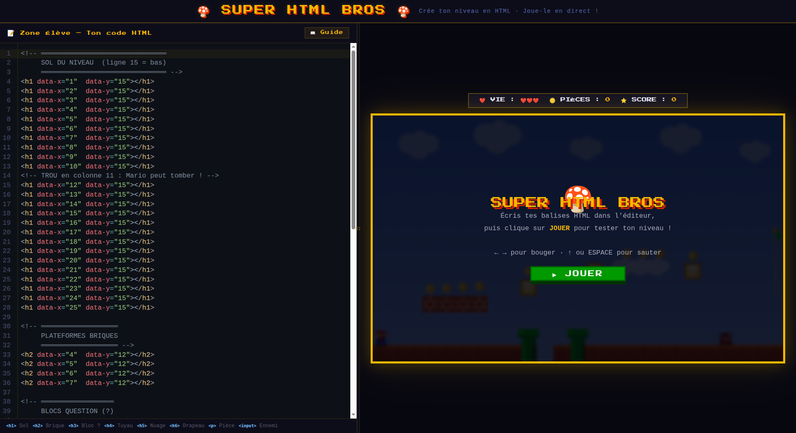

Everything you need to build a Svelte project, powered by [`sv`](https://github.com/sveltejs/cli).

## Creating a project

If you're seeing this, you've probably already done this step. Congrats!

```sh
# create a new project
npx sv create my-app
```

To recreate this project with the same configuration:

```sh
# recreate this project
npx sv@0.15.1 create --template minimal --types jsdoc --add prettier eslint sveltekit-adapter="adapter:node" --install npm .
```

## Developing

Once you've created a project and installed dependencies with `npm install` (or `pnpm install` or `yarn`), start a development server:

```sh
npm run dev

# or start the server and open the app in a new browser tab
npm run dev -- --open
```

## Building

To create a production version of your app:

```sh
npm run build
```

You can preview the production build with `npm run preview`.

> To deploy your app, you may need to install an [adapter](https://svelte.dev/docs/kit/adapters) for your target environment.

## Level elements reference

All elements are placed using `data-x` and `data-y` attributes (1-based grid coordinates). An optional CSS class `red`, `green`, or `blue` applies a color filter to the element.

### Blocks

| Illustration | HTML tag | Type | Description |
| --- | --- | --- | --- |
| 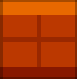 | `<h1>` | Ground | Solid ground tile — brown brick platform, fully impassable |
| 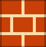 | `<h2>` | Brick | Solid brick block — standard breakable-looking wall tile |
|  | `<h3>` | Question | Animated `?` block — awards +50 coins and score when hit from below |
| 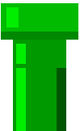 | `<a>` | Pipe | Green pipe — places a `pipe_top` + `pipe_body` pair; link two pipes with `id` and `href="#id"` for warp travel |
| 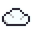 | `<h5>` | Cloud | One-way platform — player can land on top and pass through from below; falls after being stood on |
| 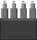 | `<hr>` | Spike | Hazard tile — damages the player on contact (costs a life) |
| 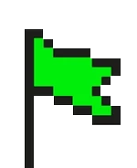 | `<h6>` | Goal / Flag | Animated flag pole — touching it wins the level (+500 score) |

### Items

| Illustration | HTML tag | Type | Description |
| --- | --- | --- | --- |
| 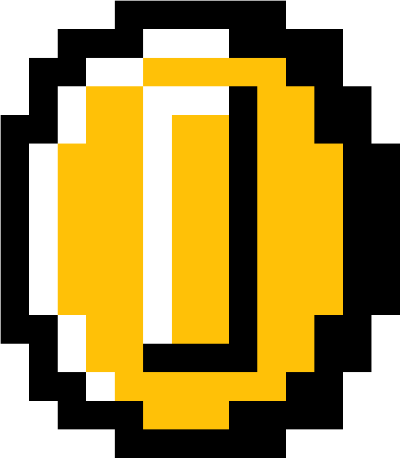 | `<p>` | Coin | Collectible coin — awards +50 score when collected |

### Entities

| Illustration | HTML tag + attribute | Type | Description |
| --- | --- | --- | --- |
| 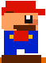 | `<input name="mario">` | Player spawn | Sets the starting position of the player |
| 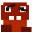 | `<input>` *(default)* | Goomba | Standard enemy — walks back and forth, squishable by jumping on top (+200 score) |
| 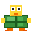 | `<input name="koopa">` | Koopa | Green-shelled enemy — walks back and forth, squishable (+200 score) |
| 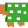 | `<input name="bowser">` or `<input type="boss">` | Bowser | Boss enemy with 3 HP — shoots fireballs, requires 3 stomps to defeat (+1000 score per hit) |
